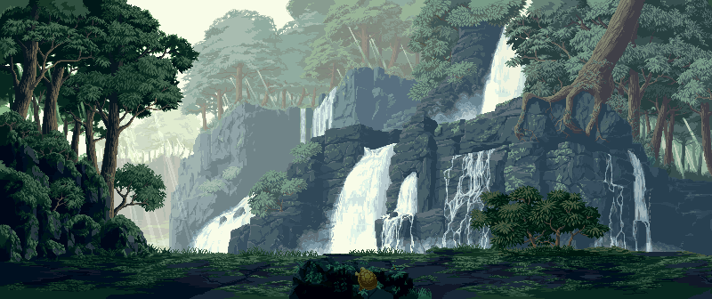

# Welcome 👋

My name is Legas — a programmer with a traditional mindset who values clarity, proven solutions, and long-term thinking.

🔧 **Areas of interest:**  
- Web development (Frontend / Backend)  
- API design, security, testing  
- Node.js, .NET, React, MongoDB, SQL  
- Structured documentation and reliable architecture

📦 **In this repository:**  
This is my “portfolio” — here you'll find learning projects, practical implementations, and examples of my approach: simple, solid, built to last.

🧭 **My focus:**  
Clean code, clear solutions, steady growth.  
I'm open to collaboration, learning, and new challenges.

# 💻 Tech Stack:

  
  
  

# 📊 GitHub Stats:
 
---

<!-- Proudly created with GPRM ( https://gprm.itsvg.in ) -->

